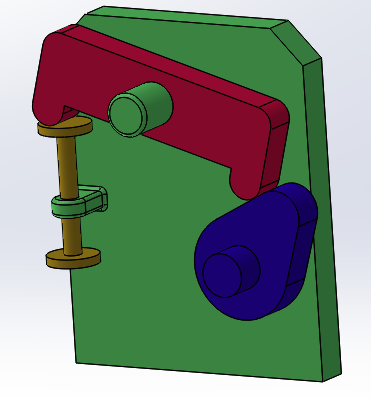
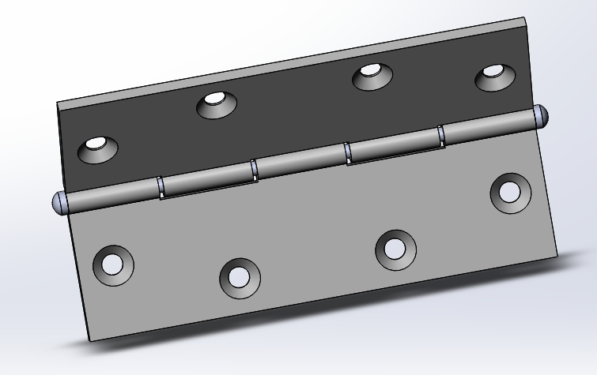

# Engineering-Notebook
Collection of 11 smaller embedded systems assignments. Recommend the last few. Completed November 6th, 2016. Original [wiki documentation](http://wiki.chssigma.com/index.php?title=Dani%27s_Engineering_Notebook)
# Table of Contents
* [LCD Hello World](#lcd-hello-world)
* [LCD Backpack](#lcd-backpack)
* [Photo Interrupter](#photo-interrupter)
* [Reading Potentiometers](#reading-potentiometers)
* [Potentiometer Servo Control](#potentiometer-servo-control)
* [Potentiometer Motor Control](#potentiometer-motor-control)
* [Processing Hello World](#processing-hello-world)
* [Solidworks](#solidworks)
* [Arduino to Processing](#arduino-to-processing)
* [Processing to Arduino](#processing-to-arduino)

# LCD Hello World
This project was about learning how to wire and code for the liquid crystal LCD display. There was some trouble understanding exactly how to wire the arduino. Besides that, it was just figuring out how exactly the liquid crystal LCD worked and how to manipulate it to my ne

  

- [code](code/code.py)
- [picture](media/lcdhw.png)

# LCD Backpak
This sub-project was to make the LCD function with an LCD backpack, which makes it much easier to wire. When the button is pressed, the LCD counts up one. If the switch is then flipped and the button is pressed the LCD counts back one. There was some trouble ensuring that the LCD didn't count up more than one when the button was held down, so I used a boolean to make sure that it only counted up or down 1.

  

- [code](code/lcdbp.ino)
- [picture](media/lcdbp.jpg)
# Photo Interrupter
For this sub-project I had to wire up a photo interrupter and an LED. We then had to make it so that when an object passes through the photo interrupter the LED turned on.

  

- [code](code/photoInt.ino)
- [media](media/photoInt.jpg)
# Reading Potentiometers
For this sub-project I had to make the brightness of an LED go up or down depending on the position of potentiometer. Then the LCD had to print the number of that brightness (0-10). This was a fairly simple assignment and there weren't very many obstacles, as it was pretty much just wiring a potentiometer, and then adding some code for the liquid crystal LCD.

  

- [code](code/read_potent.ino)
- [media](media/Potentiometer_LCD_Backpack.gif)
# Potentiometer Servo Control
For this sub-project I had to connect a potentiometer to a servo and make the servo turn in the direction corresponding to the direction the potentiometer was turned.

  

- [code](code/servo_control.ino)
- [picture](media/servo_control.gif)
# Potentiometer Motor Control
For this sub-project, I had to wire up a motor and a potentiometer. As the potentiometer is turned up, the motor spins at a faster speed, and when the potentiometer is turned back, the motor slows down again. I had to use a battery pack, with four AA batteries, as the motor draws too much current. After it was wired, the code was very simple, as it was almost identical to that of a potentiometer controlled servo.

  

- [code](code/motor_control.ino)
- [picture](media/motor_control.gif)
# Processing Hello World
For this project I had to use a new program called processing, which draws sketches based on the code written. The goal of the code was too draw a circle, and make it bounce around the screen, without going past the boundaries.

  

- [code](code/phw.ino)
- [picture](media/processinghw.gif)
# Solidworks
Here are three advanced solidworks assignments. 
## Advanced Motion Study
For this assignment, I had to create a moving assembly in Solidworks, which could then be analyzed. It consisted of four parts which were; a base, a cam, a valve, and a rocker arm. The base was just a piece that everything was connected to. The cam rotated on a pillar of the base, moving the rocker arm up. When one side of the rocker arm moved up, the other side pushed the valve down, which had a spring on it. The spring pushed the left side of the rocker arm back up, making the right side go down in accordance with the cams's movements. We had to adjust the spring we placed on the valve in order to ensure that the rocker arm didn't come off of the cam when rotating.

  

- [picture](media/advancedMS.png)
## Advanced Design Features
For this assignment I had to run through the hinge tutorial on Solidworks. I did something like this last year.

  

- [picture](media/advancedDF.png)
## Stress Analysis
For this assignment I had to create a part and then simulate what would happen if a certain amount of pressure was placed on one end of it. Then, I had to ensure that the factor of safety was above one at all points, in order to ensure there wasn't too much pressure on any one point.

  

- [picture](media/stress_analysis.png)
# Arduino to Processing
In this assignment I had to use Processing and Arduino. I had to wire a potentiometer, and then write arduino code that read the value of the potentiometer, in degrees. Then, I created a processing program that read the value of the potentiometer, and drew a speedometer. If the potentiometer was turned one way then the speedometer went that direction, and if the other then it went the other way. I had some trouble with the processing part because drawing an arc was new, and sin and cos were difficult to figure out.

  

- [Arduino Code](code/ardToProcArd.ino)
- [Processing Code](code/ardToProcProc.ino)
- [picture](media/ard_to_proc.gif)
# Processing to Arduino
This assignment was pretty much a reverse of arduino to processing. Instead of inputting something into the arduino and having processing spit something out, I did something on processing and had the arduino react. Specifically, a servo reacted to the movement of the mouse in processing. the processing code was to simply draw a line down the middle, and then if the mouse moved to the left of the line the servo turned one way, and if it moved to the right the servo turned the other, within a 180 degree radius.

  

- [Arduino Code](code/procToArdArd.ino)
- [Processing Code](code/procToArdProc.ino)
- [picture](media/proc_to_arduino.gif)
